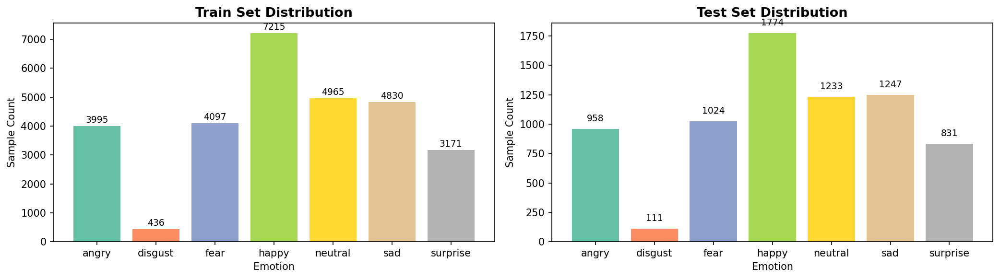
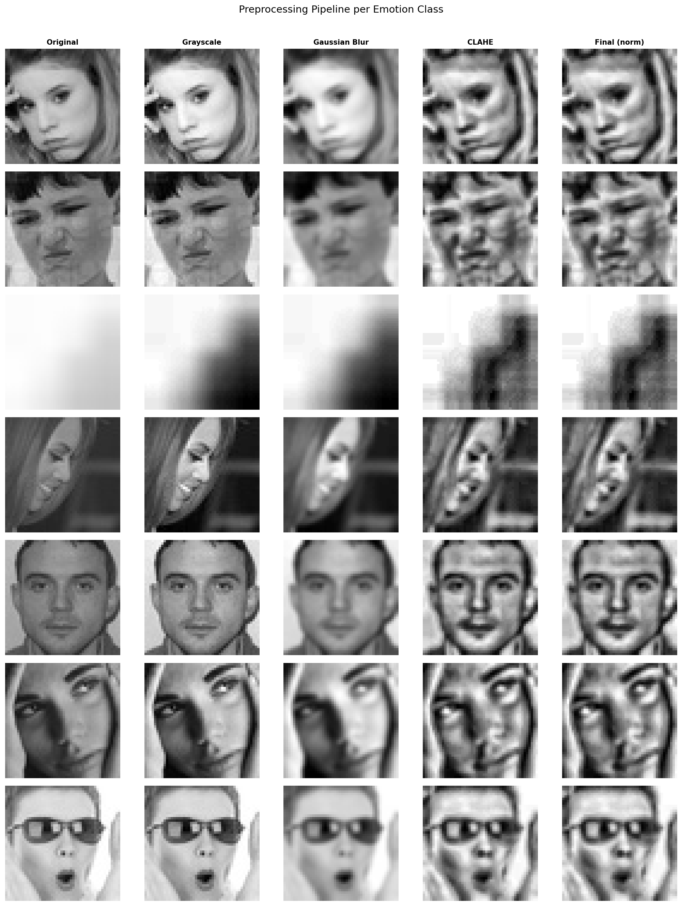
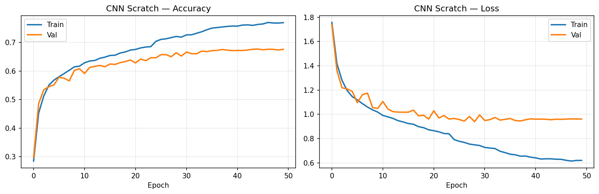
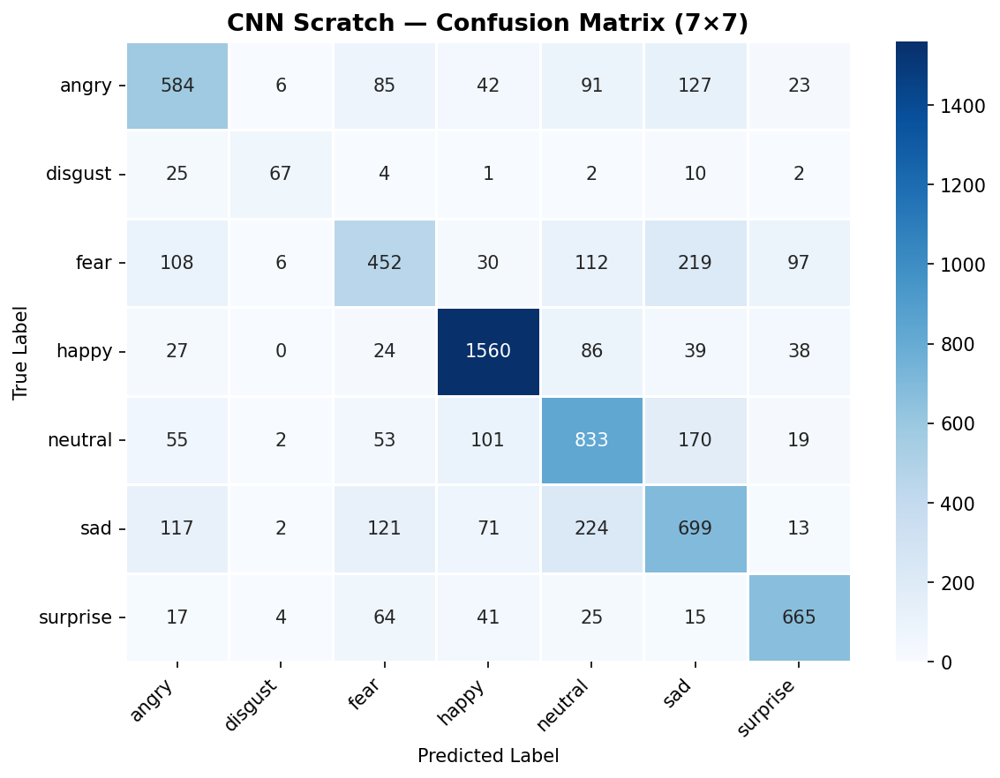

# 😄 Facial Emotion Recognition
### Real-Time Emotion Detection using CNN + OpenCV


---

## 📌 Overview

A real-time **Facial Emotion Recognition** system built as part of our **6th Semester Computer Vision course** at **Dawood University of Engineering & Technology (DUET)**. The system detects and classifies **7 human emotions** from a live webcam feed using a custom-trained **Convolutional Neural Network (CNN)**.

---

## 🎯 Emotions Detected

| Emotion | Emoji |
|---------|-------|
| Happy | 😄 |
| Sad | 😢 |
| Angry | 😠 |
| Fear | 😨 |
| Disgust | 🤢 |
| Surprise | 😲 |
| Neutral | 😐 |

---

## 🗂️ Dataset

**FER-2013 (Facial Expression Recognition 2013)**

- **Source:** [Kaggle — msambare/fer2013](https://www.kaggle.com/datasets/msambare/fer2013)
- **Total Images:** ~35,000 grayscale face images
- **Image Size:** 48 × 48 pixels
- **Classes:** 7 emotion categories
- **Split:** Train (~28,000) | Test (~7,000)



---

## 🧠 Models Trained & Compared

We trained and compared **3 different architectures** to find the best performer:

| Model | Val Accuracy | Parameters |
|-------|-------------|------------|
| ✅ **CNN from Scratch** | Best | ~323K |
| MobileNetV2 (Frozen) | — | ~2.3M |
| MobileNetV2 (Fine-tuned) | — | ~2.3M |
| VGG-Style | — | ~800K |

**Custom CNN from Scratch** outperformed all others and was selected as the final deployment model.

---

## 🏗️ CNN Architecture (Final Model)

```
Input (48×48×1 Grayscale)
    ↓
Block 1: Conv2D(32) → BN → Conv2D(32) → BN → MaxPool → Dropout(0.25)
    ↓
Block 2: Conv2D(64) → BN → Conv2D(64) → BN → MaxPool → Dropout(0.25)
    ↓
Block 3: Conv2D(128) → BN → Conv2D(128) → BN → MaxPool → Dropout(0.25)
    ↓
GlobalAveragePooling2D
    ↓
Dense(256) → Dropout(0.5)
    ↓
Dense(7, Softmax) → Emotion Output
```

---

## ⚙️ Preprocessing Pipeline



Training preprocessing steps:
- Grayscale conversion (1 channel)
- Resize to 48×48
- Normalize pixel values (÷255 → range 0.0 to 1.0)

Data Augmentation applied during training:
- Random horizontal flip
- Random brightness adjustment
- Random contrast adjustment

---

## 📈 Training Configuration

| Parameter | Value |
|-----------|-------|
| Optimizer | Adam (lr=0.001) |
| Loss Function | Categorical Crossentropy |
| Batch Size | 64 |
| Max Epochs | 50 |
| Early Stopping | patience=8 |
| LR Scheduler | ReduceLROnPlateau (factor=0.5) |



---

## 📊 Evaluation



---

## 🚀 Real-Time Detection Pipeline

```
Webcam Frame
    ↓
Haar Cascade Face Detection (OpenCV)
    ↓
Face Crop + Preprocess (Grayscale → 48×48 → Normalize)
    ↓
CNN Model Predict
    ↓
Emotion Label + Confidence Score + Bounding Box
```

**Features of real-time system:**
- Live webcam emotion detection
- Confidence score displayed per emotion
- 7-emotion probability bar chart on screen
- Frame-skip optimization for better FPS
- Screenshot capture with `S` key
- Quit with `Q` or `ESC`

---

## 🛠️ Tech Stack

- **Language:** Python 3.11
- **Deep Learning:** TensorFlow / Keras
- **Computer Vision:** OpenCV
- **Data Processing:** NumPy, Pandas
- **Visualization:** Matplotlib, Seaborn
- **Training Platform:** Google Colab (T4 GPU)
- **Dataset Source:** Kaggle

---

## 📁 Project Structure

```
Facial-Emotion-Recognition/
├── main.py                         # Real-time webcam detection
├── train_emotion_classifier.ipynb  # Model training notebook
├── fixed_model.keras               # Final trained model
├── class_distribution.png          # Dataset visualization
├── preprocessing_pipeline.png      # Preprocessing steps
├── cnn_scratch_history.png         # Training curves
├── confusion_matrix_cnn_scratch.png # Model evaluation
└── README.md
```

---

## ▶️ How to Run

**1. Install dependencies:**
```bash
pip install tensorflow opencv-python numpy
```

**2. Run webcam detection:**
```bash
python main.py --webcam
```

**3. Run on image:**
```bash
python main.py --images photo.jpg
```

**4. Run on folder of images:**
```bash
python main.py --folder ./test_images
```

---

## 👥 Team

Built by a team of 4 students as part of the **Computer Vision** course — **6th Semester, DUET Karachi**.

---

## 🏫 Course Info

| | |
|-|-|
| **University** | Dawood University of Engineering & Technology (DUET) |
| **Department** | Artificial Intelligence |
| **Course** | Computer Vision |
| **Semester** | 6th Semester |
